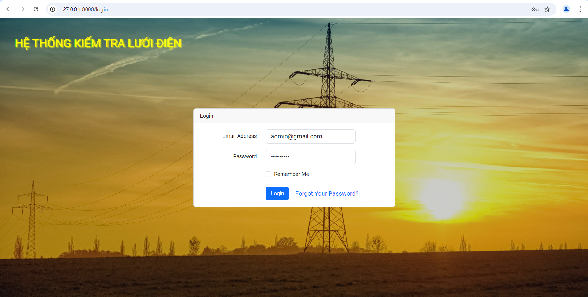
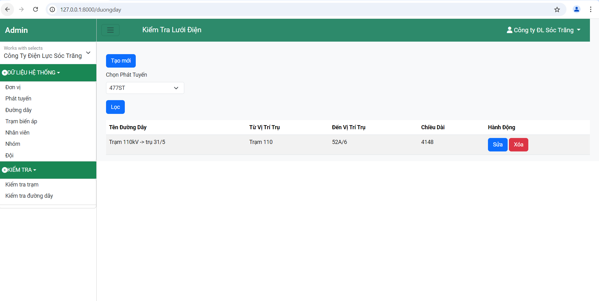
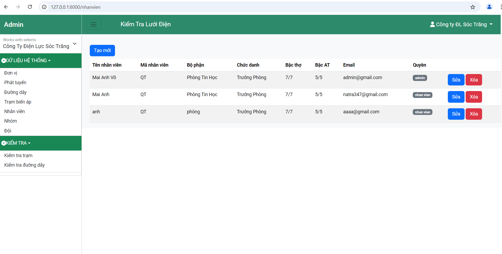
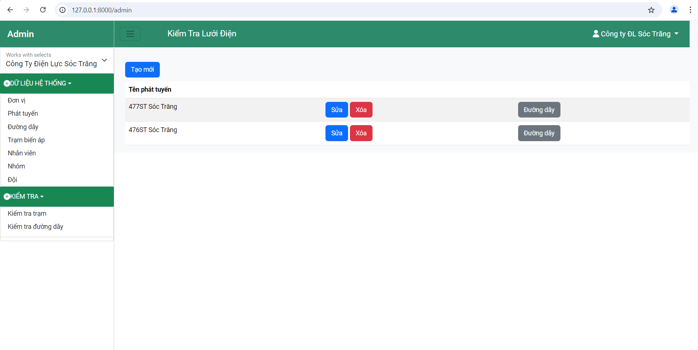
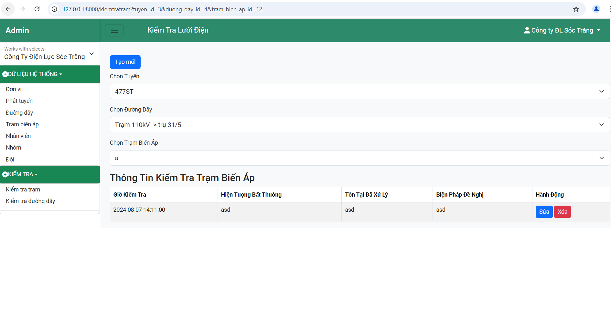

# Products website 
This is a grid management website that provides login, route, line and substation management functions for the grid. There is also group, team, staff management and staff assignment.

## Installation
- Clone the repository and navigate to the project directory.

## Features
- login
- route, line and substation management functions for the grid and test forms.
- group, team, staff management
- staff assignment

## Technologies
- HTML
- CSS
- JavaScript
- PHP
- LARAVEL
- Bootstrap

## Screenshots
 
 
 
 
 